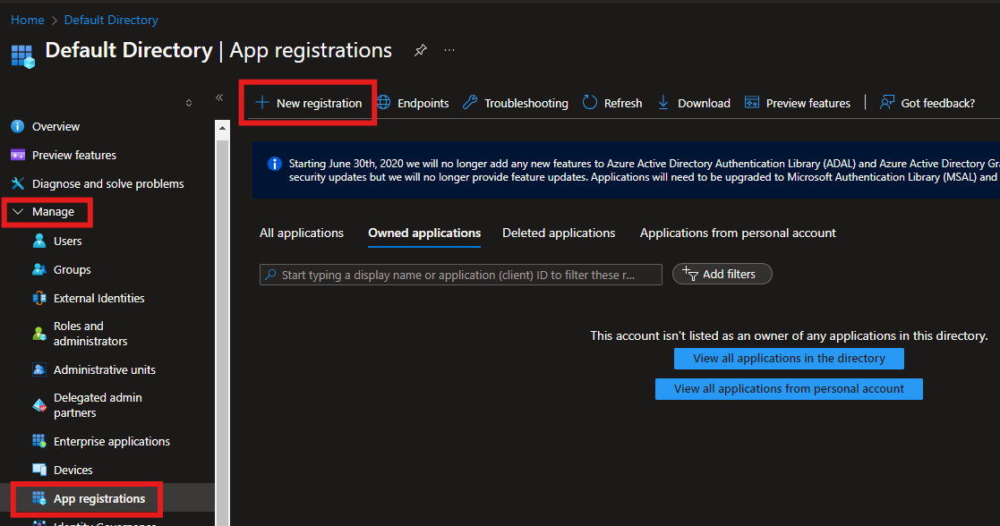
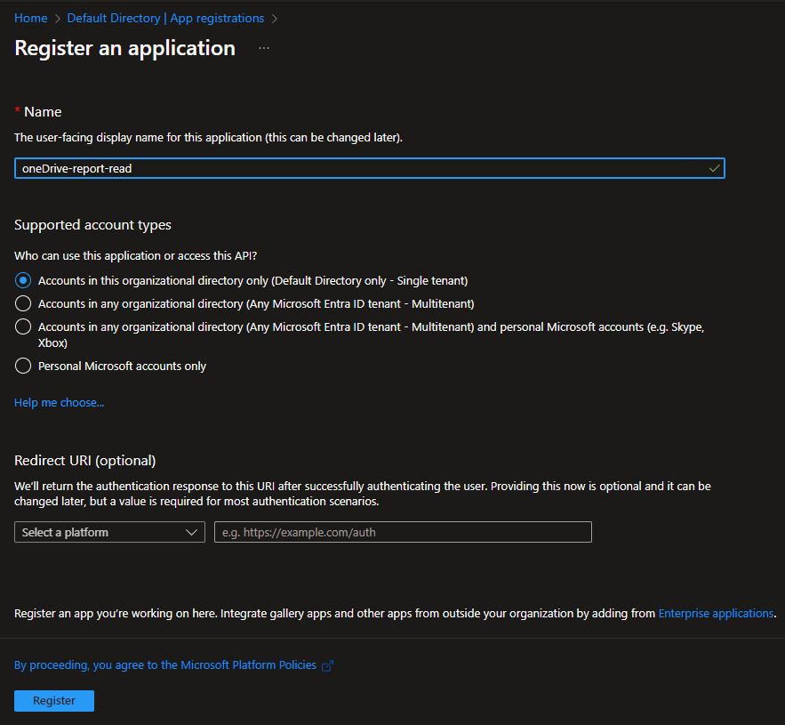
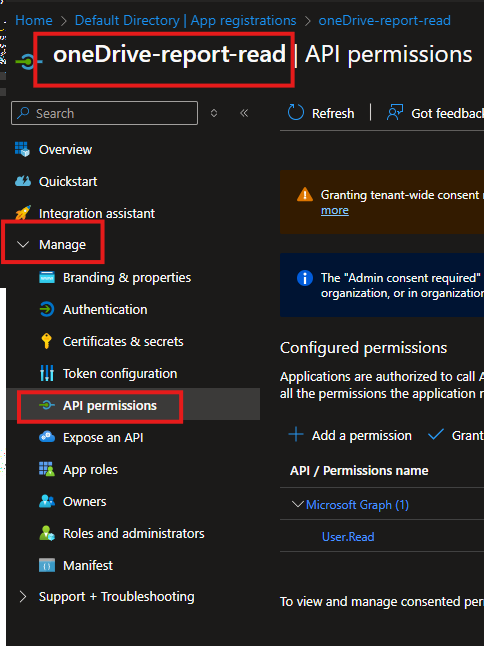
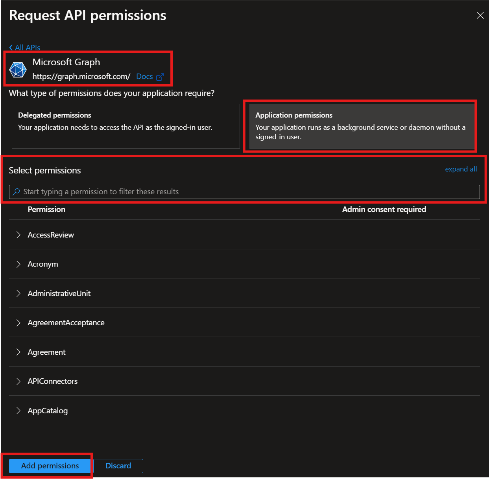
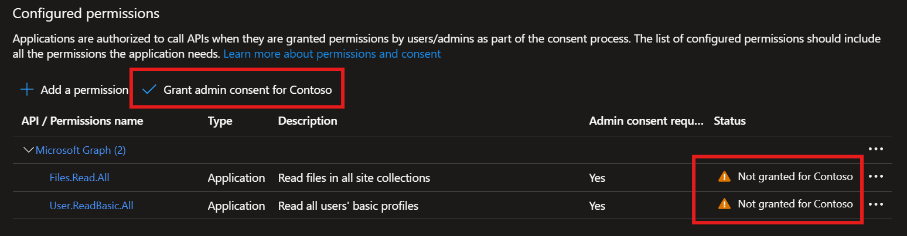
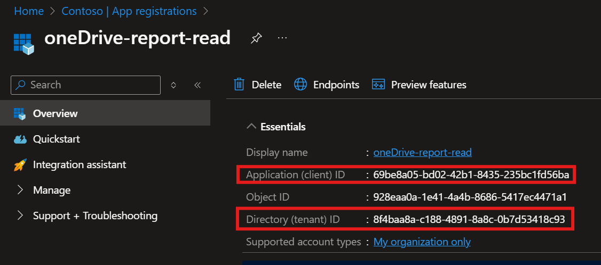
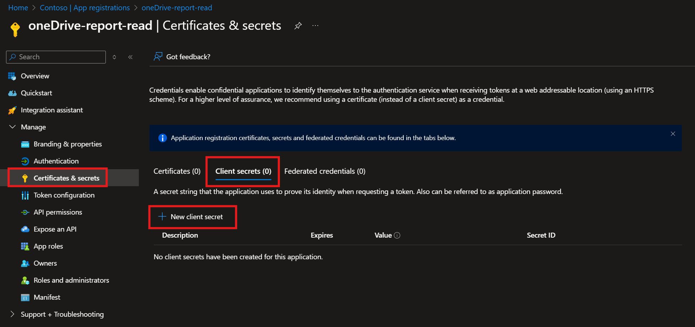
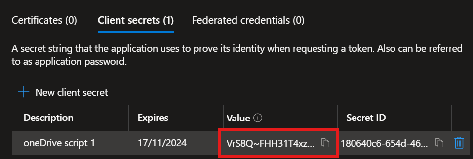

# Service Principle 

In order to use the Script or the notebook we need get read permissions to SharePoint/OneDrive.

## Create Service principle

Start by going to **Entra** or **AzureAD**, under **Mange** section you'll find **App registration** 

When in **App registration** click the **New registration**, that will take you the **Register an application** 

Form **Register an application** to give you app a any name you like and leave all other setting as is. The other options are for other uses of Service Principles that we will not be using this app for.

## Give your app permissions

Form the APP page find **API permissions** under the **Mange** section in left nav.

There you will find a button called Add a permission. Here you need to be under the **Microsoft APIs** click on **Microsoft Graph** and then the **Application permissions**, from there you can search for the permissions listed below add then all.
After that click the **Add permission** button, to save them.

1. Files.Read.All
2. User.ReadBasic.All

> Note: you can remove the user read permission, you can do that by clicking three little dots on right of the object.

Note the the new permissions have the status **Not Granted**, you need to grant then access. You can do that by clicking the **Grant admin concent** button over it. waite for the status to change and then you are done.

## Generate a new secret

In order for our script use the user principle we need to connect to it and we do that by using `tenant id`, `client id` and a `secret`, these information can be added to the top of the script. The tenant and client id are available in the overview page.

To get the secret you need to generate one.

> I recommend that for the use of this script you generate a new one for each session, and then delete it as soon as you are done.

From the overview page find **Certificates & secrets** under the **Mange** section in the left nav, when on that page you can find the **Add client secret** button.

Then just write description that would remind you what the secret was used for, add a expiation date you think you need it and click the Add button. Just copy the Secret value and you are done.

> Note: The secret value is only readable for as long as you are on the page.

